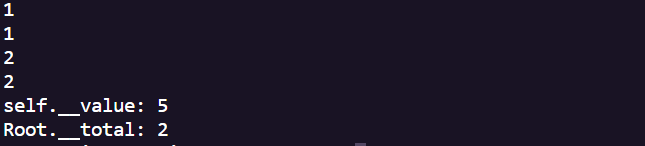

# python方法详解

```python
class Root:
    __total = 0
    def __init__(self,v):
        self.__value = v
        Root.__total += 1
    def show(self):
        print('self.__value:',self.__value)
        print('Root.__total:',Root.__total)
    
    @classmethod
    def classShowTotal(cls):
        print(cls.__total)

    @staticmethod
    def staticShowTotal():
        print(Root.__total)
    
r = Root(3)
r.classShowTotal()
r.staticShowTotal()

rr = Root(5)
Root.staticShowTotal()
Root.classShowTotal()

Root.show(rr)
```



### 1.数据成员

数据成员用来描述类或对象的某些特征或属性，可以分为**属于对象的数据成员和属于类的数据成员两类**

 > **属于对象的数据成员：**在**构造方法**中定义，而且在定义和在实例方法中访问数据成员时往往以self作为前缀，同一个类的不同对象的数据成员之间互不影响

 > **属于类的数据成员：**不在任何成员方法之内定义，是该类所有对象共享的，不属于任何一个对象

**在主程序中或类的外部，属于对象的数据成员只能通过对象名访问；而属于类的数据成员可以通过类名或对象访问**

```python
class SingleInstance:
    num = 0
    def __init__(self):
        if SingleInstance.num>0:
            raise Exception('only create one object.')
        SingleInstance.num += 1
```

### 2.成员方法

**普通实例方法：**以self作为第一个参数，**所有的实例方法都必须至少有一个self参数，必须是方法的第一个形参**，在实例方法中访问实例成员时需要以self为前缀，但在外部通过对象名调用对象方法时并不需要传递这个参数，因为通过对象调用公有方法时会把对象隐式绑定到self参数

```python
def show(self):
        print('self.__value:',self.__value)
        print('Root.__total:',Root.__total)
```

**静态方法和类方法：**可以通过类名和对象名调用，但在这两种方法中不能直接访问属于对象的成员，只能访问属于类的成员

>**类方法：**一般以cls作为类方法的第一个参数表示该类自身，在调用类方法时不需要为该参数传递值，而静态参数可以不接收任何参数

```python
 	@classmethod
    def classShowTotal(cls):
        print(cls.__total)

    @staticmethod
    def staticShowTotal():
        print(Root.__total)
```

### 3.属性

**属性：**属性是一种特殊形式的**成员方法**，综合了公开数据成员和成员方法二者的有点，既可以像成员方法那样对值进行必要的检查，又可以像数据成员一样灵活的访问

```python
class Test:
    def __init__(self,value):
        self.__value = value
       
    @property
    def value(self):		#只读属性不允许修改值
        return self.__value
    
```
下面的代码则把属性设置为可读、可修改、而不允许删除


```python
class Test:
    def __init__(self,value):
        self.__value = value
    
    def __get(self):
        return self.__value
    def __set(self,v):
        self.__value = v
    
    value = property(__get,__set)

    def show(self):
        print(self.__value)
```

下面的代码设置为可读、可修改、可删除

```python
class Test2:
    def __init__(self,value):
        self.__value = value
    
    def __get(self):
        return self.__value
    
    def __set(self,v):
        self.__value = v
    
    def __del(self):
        del self.__value
    
    value = property(__get,__set,__del)
    
    def show(self):
        print(self.__value)
```

### 4.继承

```python
class Person(object):
    def __init__(self,name='',age=20,sex='man'):
        self.setName(name)
        self.setAge(age)
        self.setSex(sex)
    
    def setName(self,name):
        if not isinstance(name,str):
            raise Exception('name must be string')
        self.__name = name
    
    def setAge(self,age):
        if type(age) != int:
            raise Exception('age must be integer')
        self.__age = age
    
    def setSex(self,sex):
        if sex not in('man','woman'):
            raise Exception('sex must be "man" or "woman"')
        self.__sex = sex
        
    def show(self):
        print(self.__name,self.__age,self.__sex,sep='\t')
    
class Teacher(Person):
    def __init__(self,name='',age=30,sex='man',department='Computer'):
        super(Teacher,self).__init__(name,age,sex)
        self.setDepartment(department)
    def setDepartment(self,department):
        if type(department) != str:
            raise Exception('department must be a string')
        self.__department = department
    
    def show(self):
        super(Teacher,self).show()
        print(self.__department)

if __name__ == '__main__':
    zhangsan = Person('Zhang San',19,'man')
    zhangsan.show()
    print('='*30)
    lisi = Teacher('Li Si',32,'man','Math')
    lisi.show()
    lisi.setAge(40)
    lisi.show()

```

python支持多继承，如果父类中有相同的方法名，而在子类中使用时没有指定父类名，则python解释器将从左到右按顺序进行搜索，使用第一个匹配的成员。